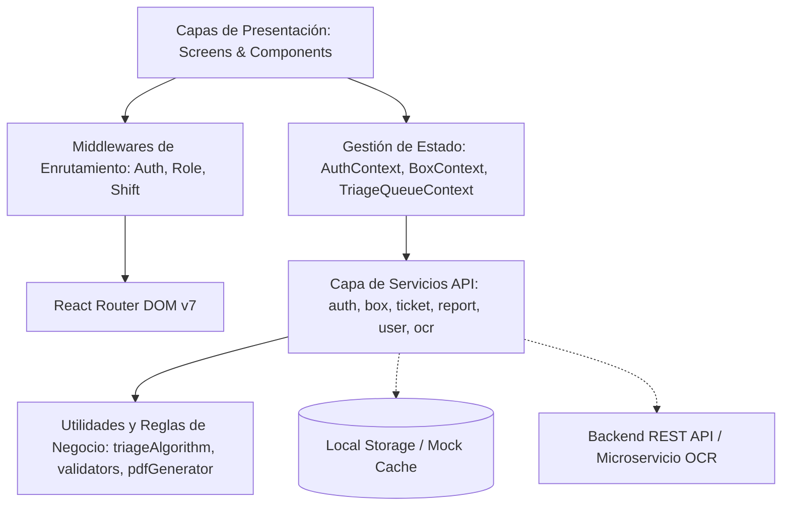

# SGTP - Sistema de Gestión de Triage y Flujo de Pacientes (Frontend)

Aplicación web Single Page Application (SPA) para la gestión hospitalaria del flujo de pacientes, triage clínico inteligente, distribución multibox, supervisión asistencial y reportería analítica en laboratorios centrales y áreas de guardia médica.

---

## 📋 Tabla de Contenidos

1. [Descripción General](#-descripción-general)
2. [Arquitectura del Frontend](#-arquitectura-del-frontend)
3. [Stack Tecnológico](#-stack-tecnológico)
4. [Estructura del Proyecto](#-estructura-del-proyecto)
5. [Seguridad, Autenticación y RBAC](#-seguridad-autenticación-y-rbac)
6. [Motor de Triage y Algoritmo de Cola](#-motor-de-triage-y-algoritmo-de-cola)
7. [Módulos del Sistema (Pantallas)](#-módulos-del-sistema-pantallas)
8. [Reglas de Negocio y Políticas Sanitarias](#-reglas-de-negocio-y-políticas-sanitarias)
9. [Configuración y Variables de Entorno](#-configuración-y-variables-de-entorno)
10. [Instalación y Despliegue](#-instalación-y-despliegue)
11. [Cuentas Demo de Prueba](#-cuentas-demo-de-prueba)

---

## 🏥 Descripción General

**SGTP** (Sistema de Gestión de Triage y Flujo de Pacientes) resuelve la coordinación operativa en el circuito asistencial de toma de muestras y laboratorio:

- **Admisión y Triage**: Registro de pacientes por DNI u obra social, categorización por severidad clínica, soporte OCR asistencial (Human-in-the-loop) para prescripciones médicas y emisión física de tickets de llamado.
- **Atención Multibox**: Cola unificada y dinámica que alimenta a los boxes disponibles en base a la urgencia médica y orden de llegada.
- **Supervisión y Jefatura Médica**: Monitoreo en vivo de tiempos de espera y atención, matriz de carga analítica, auditoría de tickets con regla de inmutabilidad y gestión de personal sanitario.
- **Secretaría y Cierre de Jornada**: Generación instantánea de reportes operativos, exportación de documentos PDF vectoriales y despacho por correo institucional.

---

## 🏗 Arquitectura del Frontend

El frontend implementa una arquitectura modular desacoplada por capas:



### Principios de Diseño y Patrones
1. **Separación de Responsabilidades**: Las vistas (`Screens`) delegan lógica de negocio y persistencia a los `Contexts` y `Services`.
2. **Pipeline de Middlewares en Rutas**: Protección por jerarquía:
   - `AlreadyAuthMiddleware`: Redirige al dashboard si la sesión ya existe.
   - `AuthMiddleware`: Bloquea acceso a usuarios no autenticados.
   - `ShiftTimeMiddleware`: Aplica control de turno laboral en tiempo real para roles operativos.
   - `RoleMiddleware`: Control de acceso granular basado en roles (RBAC).
3. **Capa de Abstracción de Datos (Service Layer)**: Encapsula llamadas a endpoints REST, proveyendo fallback automático y modo offline mediante almacenamiento reactivo.
4. **Validaciones Sanitarias Rigurosas**: Reglas específicas de validación para documentos de identidad (DNI), nombres, ventanas de inmutabilidad de tickets y justificaciones clínicas.

---

## ⚙ Stack Tecnológico

| Componente | Tecnología | Versión | Propósito |
|---|---|---|---|
| **Core** | React | `^19.2.8` | Biblioteca de interfaz reactiva y componentes funcionales |
| **Bundler / Dev Server** | Vite | `^8.3.0` | Empaquetado optimizado, HMR instantáneo y build ESM |
| **Routing** | React Router DOM | `^7.18.4` | Enrutamiento declarativo SPA, layouts anidados y guards |
| **Estilos** | CSS Puro (Vanilla CSS) | CSS3 | Estilizado modular, variables CSS nativas, temas y microanimaciones |
| **Generación de Reportes** | jsPDF | `^4.2.1` | Generación y exportación de reportes PDF vectoriales en cliente |
| **Iconografía** | Lucide React | `^1.47.0` | Iconos vectoriales coherentes de sistema y salud |
| **Tokens & Auth** | jwt-decode | `^4.0.0` | Decodificación e inspección de JWT en frontend |
| **Linter** | Oxlint | `^1.81.0` | Linter ultra-rápido en Rust para control de calidad de código |

---

## 📁 Estructura del Proyecto

```text
SGTP_Frontend/
├── public/                     # Assets estáticos y favicons
│   ├── favicon.svg
│   └── icons.svg
├── src/
│   ├── assets/                 # Imágenes estáticas e ilustraciones
│   │   └── hero.png
│   ├── components/             # Componentes UI transversales y reutilizables
│   │   ├── Navbar/             # Barra de navegación superior con conmutador demo
│   │   ├── PatientSearch/      # Búsqueda en vivo de pacientes con historial
│   │   ├── RecipeOcrModal/     # Modal de captura OCR de recetas médicas
│   │   ├── ShiftLockModal/     # Bloqueo de interfaz por turno no habilitado
│   │   ├── TicketModal/        # Emisión y vista imprimible del ticket físico
│   │   └── TriageBadge/        # Badges semánticos de severidad de triage
│   ├── config/                 # Configuración de entornos y URLs de backend
│   │   └── enviroment.config.js
│   ├── context/                # Contextos globales de React (Estado transversal)
│   │   ├── AuthContext.jsx         # Autenticación, sesión y RBAC
│   │   ├── BoxContext.jsx          # Estado de boxes y asignaciones
│   │   └── TriageQueueContext.jsx  # Cola centralizada multibox y priorización
│   ├── middlewares/            # Guards y middlewares de rutas
│   │   ├── AlreadyAuthMiddleware.jsx  # Redirección de login si está autenticado
│   │   ├── AuthMiddleware.jsx         # Validación de token activo
│   │   ├── RoleMiddleware.jsx         # Restricción por rol (RBAC)
│   │   └── ShiftTimeMiddleware.jsx    # Verificación de turno horario activo
│   ├── Screens/                # Vistas principales del sistema
│   │   ├── AdmisionScreen/     # Módulo de Admisión, Triage y Emisión de Tickets
│   │   ├── TecnicoBoxScreen/   # Módulo de Box de Atención y Extracciones
│   │   ├── JefaScreen/         # Módulo de Jefatura, Supervisión y Auditoría
│   │   ├── SecretariaScreen/   # Módulo de Secretaría, Cierre y Reportes
│   │   ├── LoginScreen/        # Acceso con política de intentos y demo picker
│   │   └── NotFoundScreen/     # Página de error 404
│   ├── services/               # Capa de integración y llamadas a API
│   │   ├── authService.js      # Login, bloqueo por 3 intentos y desbloqueo
│   │   ├── boxService.js       # Gestión de estado de boxes y llamadas
│   │   ├── ocrService.js       # Simulación de inferencia OCR on-premise
│   │   ├── reportService.js    # Agregación y cálculo de métricas de jornada
│   │   ├── ticketService.js    # CRUD y auditoría inmutable de tickets
│   │   └── userService.js      # Consulta y alta de personal sanitario
│   ├── utils/                  # Algoritmos puros y funciones utilitarias
│   │   ├── formatters.js       # Formateo de fechas, horas y tiempos de espera
│   │   ├── pdfGenerator.js     # Generación de informe clínico en formato PDF
│   │   ├── triageAlgorithm.js  # Motor de ordenamiento por severidad y FIFO
│   │   └── validators.js       # Validaciones sanitarias (DNI, nombres, 24h)
│   ├── App.css                 # Estilos globales de layouts y componentes
│   ├── App.jsx                 # Declaración de rutas y jerarquía de Providers
│   ├── index.css               # Reset CSS, tipografía y variables de color
│   └── main.jsx                # Punto de entrada de React con BrowserRouter
├── .gitignore
├── .oxlintrc.json              # Configuración de linter Oxlint
├── index.html
├── package.json
└── vite.config.js
```

---

## 🔒 Seguridad, Autenticación y RBAC

### 1. Modelo de Roles (RBAC)
El sistema soporta 5 roles con permisos y vistas diferenciadas:

- **Admin**: Acceso absoluto al sistema, auditoría y administración de credenciales.
- **Jefa (Supervisión Médica)**: Visualización en tiempo real de boxes y métricas, auditoría de tickets (ventana de 24h), gestión de excepciones de turno y alta de personal operativo.
- **Admision**: Registro de pacientes, ejecución de triage, confirmación de prescripciones (OCR) y emisión de tickets asistenciales.
- **Box (Técnico)**: Recepción de pacientes convocados, control del estado de su box (`Disponible`, `En atencion`, `Fuera de servicio`) y registro de estudios procesados.
- **Secretaria**: Vista de monitoreo asistencial, consulta de métricas agregadas, exportación de reportes PDF y despacho por correo electrónico.

### 2. Política de Bloqueo por Intentos Fallidos
- El servicio de autenticación monitorea los intentos consecutivos de inicio de sesión (`cant_intentos`).
- Si se ingresan credenciales incorrectas **3 veces consecutivas**, la cuenta queda **bloqueada por seguridad**.
- El desbloqueo debe realizarse mediante un usuario con facultades administrativas (`unlockUserApi`).

### 3. Restricción por Turno Laboral (Shift Enforcement)
- Los roles operativos (`Admision`, `Box`, `Secretaria`) disponen de la bandera `dentro_horario`.
- Si el usuario intenta operar fuera de su jornada asignada, `ShiftTimeMiddleware` intercepta la navegación y renderiza el modal informativo `ShiftLockModal`.
- Los roles `Admin` y `Jefa` gozan de bypass permanente de turno (acceso 24/7).
- La Jefatura puede habilitar excepciones individuales de turno en tiempo real desde su panel.

---

## 📊 Motor de Triage y Algoritmo de Cola

El orden de atención en la cola multibox centralizada no depende únicamente del orden de llegada, sino de una ponderación médica estricta calculada por `triageAlgorithm.js`:

### Escala de Clasificación Clínica

| Código | Categoría | Prioridad | Nivel de Urgencia | Color Semántico | Requiere Justificación |
|---|---|---|---|---|---|
| **1** | **Guardia** | `1` (Máxima) | Crítico / Inmediato | Rojo `#ef4444` | No |
| **2** | **Médicos** | `2` | Urgente | Naranja `#f97316` | No |
| **3** | **Discapacidad** | `3` | Prioritario | Amarillo `#eab308` | No |
| **4** | **Oncología** | `4` | Programado preferente | Celeste `#0284c7` | No |
| **5** | **Extracción con turno** | `5` | Demanda espontánea agendada | Verde `#22c55e` | No |
| **6** | **Extracción sin turno** | `6` | Demanda espontánea libre | Violeta `#a855f7` | No |
| **7** | **Otro** | `7` | Caso no clasificado | Gris `#64748b` | **Sí (Obligatoria)** |

### Criterio de Ordenamiento Multibox
```javascript
// triageAlgorithm.js: sortQueueByPriority
1. Menor valor numérico de prioridad clínica (1 tiene preferencia sobre 2, etc.)
2. En caso de igual nivel de triage, desempate por orden de llegada estricto (FIFO: fecha_hora_admision más antigua)
```

---

## 🖥 Módulos del Sistema (Pantallas)

### 1. Admisión (`/admision`)
- Formulario de alta rápida de paciente con validación de DNI (6 a 9 dígitos numéricos) y nombres sanitarios (caracteres alfabéticos, espacios y tildes).
- Asistente de autocompletado con búsqueda en historial por DNI, nombre u obra social.
- Matriz de selección de Triage con tarjetas semánticas.
- **Asistente OCR de Recetas**: Permite cargar una imagen de orden médica, procesarla simulando un modelo on-premise (PaddleOCR/TrOCR) y sugerir prácticas de laboratorio para confirmación manual (*Human-in-the-loop*).
- **Emisión de Ticket**: Generación del ticket formal de atención con número de llamado exterior y tótem identificador.

### 2. Box de Atención (`/box`)
- Selector de box activo (Boxes 1 a 4).
- Interruptor de estado del box: `Disponible`, `En atencion` y `Fuera de servicio`.
- Panel del paciente en curso con desglose de datos personales, clasificación de triage y lista de estudios prescritos con checks de completitud.
- Botón **"Llamar Siguiente Paciente"**: Consulta atómicamente la cola multibox priorizada y convoca al paciente de mayor severidad.
- Monitoreo en vivo de la cola de espera de todos los boxes.

### 3. Supervisión y Jefatura (`/supervision`)
- Métricas operativas en vivo: tiempo promedio de espera (admisión ➔ llamado), tiempo promedio de atención (llamado ➔ cierre), pacientes ingresados y casos críticos.
- Matriz de carga analítica por área (Hemograma, Bioquímica, Orina, Cultivo, etc.).
- **Auditoría de Tickets**: Capacidad de rectificar clasificaciones de triage y justificaciones respetando la ventana de inmutabilidad de 24 horas.
- **Gestión de Personal Sanitario**: Alta de nuevo personal operativo (con restricción estricta de jerarquía: la Jefa no puede crear cuentas con rol `Admin` o `Jefa`) y habilitación de excepciones de turno.

### 4. Secretaría y Cierre (`/reportes`)
- Cuadro de mando diario con distribución porcentual de atenciones por categoría de triage.
- Estadísticas consolidadas de tiempos y volumen asistencial.
- **Exportación PDF**: Generación en tiempo real de informes A4 formateados institucionalmente mediante `jsPDF`.
- **Despacho por Email**: Simulación de envío del balance diario de la guardia por SMTP seguro.

---

## ⚖ Reglas de Negocio y Políticas Sanitarias

1. **Inmutabilidad a las 24 Horas**: Todo ticket generado puede ser rectificado únicamente por roles autorizados (`Jefa` o `Admin`) durante sus primeras 24 horas de vida. Vencido ese período, el registro se congela como evidencia histórica inalterable.
2. **Justificación Técnica Obligatoria**: La selección del triage "Otro" (Categoría 7) bloquea la emisión si el operador no especifica un motivo médico de al menos 5 caracteres.
3. **Control de Jerarquía en Altas de Usuario**: Ningún usuario con rol `Jefa` puede crear perfiles de igual o superior jerarquía (`Jefa` o `Admin`), previniendo escalamientos de privilegios.
4. **Sanitización de Datos de Identidad**: El sistema previene el ingreso de símbolos, números o caracteres anómalos en los campos de nombre y apellido de pacientes.

---

## 🌐 Configuración y Variables de Entorno

El archivo de configuración principal se encuentra en `src/config/enviroment.config.js`. Se pueden definir las siguientes variables de entorno en un archivo `.env` en la raíz del proyecto:

```bash
# URL base del Backend REST API
VITE_API_URL=http://localhost:8000

# URL del microservicio de inferencia OCR
VITE_OCR_SERVICE_URL=http://localhost:8001/ocr

# Habilitar cifrado JWE de payloads (Opcional)
VITE_ENABLE_JWE=false
```

---

## 🚀 Instalación y Despliegue

### Prerrequisitos
- **Node.js**: versión 18 o superior recomendada.
- **npm**: versión 9 o superior.

### Pasos de Instalación

1. Clonar el repositorio:
   ```bash
   git clone https://github.com/BahlMartin/SGTP_Frontend.git
   cd SGTP_Frontend
   ```

2. Instalar dependencias del proyecto:
   ```bash
   npm install
   ```

3. Iniciar el servidor de desarrollo:
   ```bash
   npm run dev
   ```
   La aplicación quedará disponible en `http://localhost:5173`.

4. Ejecutar el linter de código (Oxlint):
   ```bash
   npm run lint
   ```

5. Compilar para producción:
   ```bash
   npm run build
   ```
   Los artefactos optimizados se generarán en la carpeta `dist/`.

---

## 👥 Cuentas Demo de Prueba

Para evaluar los diferentes flujos y controles de acceso sin necesidad de base de datos externa, el sistema incluye usuarios demo preconfigurados con la contraseña común `password123`:

| Rol | Correo Electrónico | Contraseña | Matrícula | Turno Asignado |
|---|---|---|---|---|
| **Admin** | `admin@sgtp.hospital.gob.ar` | `password123` | `ADM-001` | Total (24hs) |
| **Jefa** | `jefa@sgtp.hospital.gob.ar` | `password123` | `MED-9941` | Supervisión |
| **Admisión** | `admision@sgtp.hospital.gob.ar` | `password123` | `ADM-4412` | Mañana (07:00 - 15:00) |
| **Box** | `box@sgtp.hospital.gob.ar` | `password123` | `TEC-3391` | Guardia (08:00 - 16:00) |
| **Secretaría** | `secretaria@sgtp.hospital.gob.ar` | `password123` | `SEC-1082` | Diurno (09:00 - 17:00) |

> 💡 **Tip**: En la pantalla de login o en la barra de navegación superior (Navbar), puedes alternar instantáneamente de rol con un solo clic para verificar el comportamiento de cada módulo y los permisos asociados.
